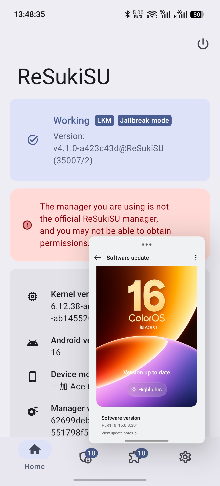

# GhostLock — OnePlus Locked Bootloader Jailbreak

Kernel exploit for OnePlus/OPPO/realme devices with locked bootloader. Achieves root + KernelSU installation without unlocking bootloader or modifying boot image. Runtime auto-detection of kernel version with multi-device offset table.

<p align="center">
  
</p>

## Vulnerability

**CVE-2026-43499** — Futex PI (Priority Inheritance) Use-After-Free

Affects Linux kernel 2.6.39 ~ 7.1. Fixed in mainline 7.1 (commit `3bfdc63936dd`). Android GKI 6.12.x remains vulnerable.

The `pselect6` syscall copies `fd_set` data onto the kernel stack. When combined with the futex PI waiter mechanism, a freed stack frame can be reclaimed as an `rt_mutex_waiter` structure. The rb-tree rebalance during PI chain walk then writes controlled values to arbitrary kernel addresses.

## Supported Devices

### Verified

| Device | SoC | Kernel | Status |
|--------|-----|--------|--------|
| OnePlus Ace 6T (PLR110) | SM8845 | `6.12.38-...-ab14275539` | **Working** |
| OnePlus Ace 6T (PLR110) | SM8845 | `6.12.38-...-ab14552068` | **Working** |

### Offsets Extracted (pending device test)

| Device | SoC | Kernel | Notes |
|--------|-----|--------|-------|
| OnePlus 15T (PLZ110) | SM8845 | `6.12.38-...-ab14552068` | Same kernel as Ace 6T. QEMU verified SP diff=-64. |
| OnePlus 15 (OP615) | SM8845 | `6.12.23-...-ab14541642` | Offsets from OTA boot.img |
| OnePlus 13 (IN2060) | SM8750 | `6.6.89-...-abogki446052083` | QEMU verified SP diff=-64. Use `PSELECT_SHIFT=-2`. |

### Not Feasible (stack layout incompatible)

The pselect stack overlay only works when the freed `rt_mutex_waiter` lands within the user-controllable region of the `stack_fds` buffer. Where the waiter lands is determined by the compiler output (PGO + LTO), not the kernel version. See [Stack Layout](#stack-layout-feasibility) for details.

| Device | SoC | Kernel | Waiter Word | Reason |
|--------|-----|--------|-------------|--------|
| OPPO Find X9 Ultra | SM8750 | 6.12.58 | 14 | task/lock in zeroed area |
| realme RMX5070 | SM6650 | 6.1.141 | 13 | task/lock in zeroed area |
| realme RMX3852 | SM8635 | 6.1.141 | 13 | Same branch as RMX5070 |
| OPPO Pad 5 (OPD2502) | MT6878 | 6.1.134 | 13 | Same branch as RMX5070 |

## Stack Layout Feasibility

With `NFDS=320`, the kernel's `core_sys_select` allocates a 256-byte `stack_fds` buffer:

```
stack_fds:  0    5    10   14 | 15   20   25   29
            ├─in─┤─out─┤─ex──┤ ├res_in┤res_out┤res_ex┤
            ◄── USER CONTROLLED ──►│◄── KERNEL ZEROED ──►
```

The exploit writes fake waiter fields (task, lock) into the fd_set input bitmaps. For this to work, the waiter's `task` and `lock` fields must fall in the controllable zone (words 0-14).

```
Ace 6T ✅ (waiter at word 2):
  ░░████████████████░░│░░░░░░░░░░░░░░░░░░
    ▲waiter      t  l │
    task/lock controllable

RMX5070 ❌ (waiter at word 13):
  ░░░░░░░░░░░░░████│██████████████░░░░░░
                 ▲  │    t     l
               waiter  task/lock ZEROED
```

**Feasibility rule**: waiter word + 11 (lock offset in rt_waiter_node) must be ≤ 14. Maximum feasible waiter word is **3**.

The waiter position is determined by the compiler's stack frame layout (PGO + LTO + BOLT optimization profiles), which varies per SoC branch. Same kernel version can have different layouts on different SoCs.

### PSELECT_SHIFT

Different kernels place the waiter at different positions within the controllable zone. Use `PSELECT_SHIFT` to adjust:

```bash
# Default (Ace 6T, 6.12): shift=0
/data/local/tmp/a/e

# OnePlus 13 (6.6): shift=-2
PSELECT_SHIFT=-2 /data/local/tmp/a/e
```

## Exploit Flow

```
Write 1 (mode=1)  →  SELinux enforcing = 0
                      (low byte of kernel ptr = 0x00)

Write 2 (mode=2)  →  task->cred = init_cred
                      (uid=0, all capabilities)

Root shell         →  ksud late-load (KernelSU LKM)
                   →  su -c load_policy (fix SELinux policycap)
                   →  dynamic manager registration
```

### Bootstrap Mode (phone standalone)

```
App (seccomp)  →  Write 1 (no perf needed)
               →  mini-adb connect TCP 5555 (RSA auth)
               →  adb shell: full exploit (perf works, no seccomp)
               →  root → KSU → network fix
```

### Auto-Boot (via ReSukiSU integration)

```
BOOT_COMPLETED → BootCompletedReceiver
  ├─ su available → skip (soft reboot / already rooted)
  └─ no root → GhostlockService → setsid exploit --bootstrap
```

## Build

```bash
NDK=/path/to/android-ndk
$NDK/toolchains/llvm/prebuilt/linux-x86_64/bin/aarch64-linux-android35-clang \
  -O2 -Wall -Isrc/core -Isrc/devices -DTARGET_CONFIG_H="target.h" \
  src/core/main.c src/core/util.c src/core/slide.c \
  src/core/fops.c src/core/pipe.c src/core/root.c \
  src/core/miniadb.c \
  -o ghostlock -fPIE -pie -pthread
```

## Prerequisites

### ksud (required for KSU installation)

GhostLock only provides root. KernelSU installation depends on **ksud** — a binary that contains embedded `kernelsu.ko` modules for each KMI version. The root script finds ksud on device and calls `ksud late-load --kmi android16-6.12`.

| Method | Steps |
|--------|-------|
| **ReSukiSU APK** (recommended) | Install [ReSukiSU](https://github.com/ReSukiSU/ReSukiSU) or this [fork](https://github.com/JoinChang/ReSukiSU). Official release bundles `libksud.so`. |
| **CI release** | Download `ksud-aarch64-linux-android.zip` from [ReSukiSU CI](https://github.com/cctv18/ReSukiSU_CI/releases) |

> Without ksud, the exploit achieves root (uid=0) but KSU won't be installed and `su` won't persist.

## Setup (one-time)

```bash
adb tcpip 5555
adb push ~/.android/adbkey /data/local/tmp/a/adbkey
adb push ghostlock /data/local/tmp/a/e && chmod 755 /data/local/tmp/a/e
```

After first successful jailbreak, `persist.adb.tcp.port=5555` is set via `resetprop` — subsequent boots are fully automatic.

## Usage

```bash
/data/local/tmp/a/e                        # Full exploit (adb shell)
/data/local/tmp/a/e --bootstrap            # Phone standalone (app context)
/data/local/tmp/a/e --write1               # SELinux disable only
PSELECT_SHIFT=-2 /data/local/tmp/a/e       # Override stack layout shift
```

> **Important**: Run within 30 seconds of boot for best KernelSnitch timing reliability.

## Adding New Devices / Kernel Versions

Only `boot.img` is needed — no root, no device access required.

### Extract offsets from boot.img

```bash
# 1. Extract kernel
python -c "import struct; d=open('boot.img','rb').read(); open('kernel','wb').write(d[4096:4096+struct.unpack_from('<I',d,8)[0]])"

# 2. Global symbols (kallsyms)
python tools/extract_target.py    # 28 offsets, auto-validated

# 3. Struct fields (BTF)
python tools/extract_btf.py kernel  # 57 offsets, auto-validated

# 4. Add to offsets.h, rebuild
```

### Coverage: 103/103 offsets from boot.img

| Source | Count | Method |
|--------|-------|--------|
| kallsyms (global symbols) | 28 | `extract_target.py` |
| BTF (struct fields) | 57 | `extract_btf.py` |
| Derived (same struct, different usage) | 9 | Automatic |
| Constants (fixed values) | 12 | No extraction needed |

### Adapting to non-OnePlus devices

The core exploit is device-agnostic. Adaptation may require:
- Different `VA_BITS` (48 vs 39) → update `target.h` memory layout
- Different timing parameters → tune `common.h`
- Different ashmem implementation (C vs Rust) → update symbol matching
- Different `PSELECT_SHIFT` → determine via QEMU kprobe test

## Files

| File | Description |
|------|-------------|
| `src/core/main.c` | Exploit entry, Write 1/2, bootstrap, root script |
| `src/core/fops.c` | pselect route, PI write mechanism |
| `src/core/util.c` | Heap spray, kernelsnitch, slab drain |
| `src/core/miniadb.c` | Mini ADB client (TCP + RSA auth) |
| `src/core/common.h` | Timing parameters, macros |
| `src/core/target.h` | Memory layout, struct field constants |
| `src/devices/offsets.h` | Aggregates all device offset tables |
| `src/devices/<device>/offsets.h` | Per-device kernel offset entries |
| `src/slide.c` | SLIDE kernel address leak |
| `src/pipe.c` | Pipe buffer manipulation |
| `src/root.c` | Root shell setup |
| `tools/extract_target.py` | Offset extraction from kallsyms |
| `tools/extract_btf.py` | Struct offset extraction from BTF |
| `tools/check_feasibility.py` | Stack layout feasibility checker |

## License

For authorized security research and educational purposes only.
